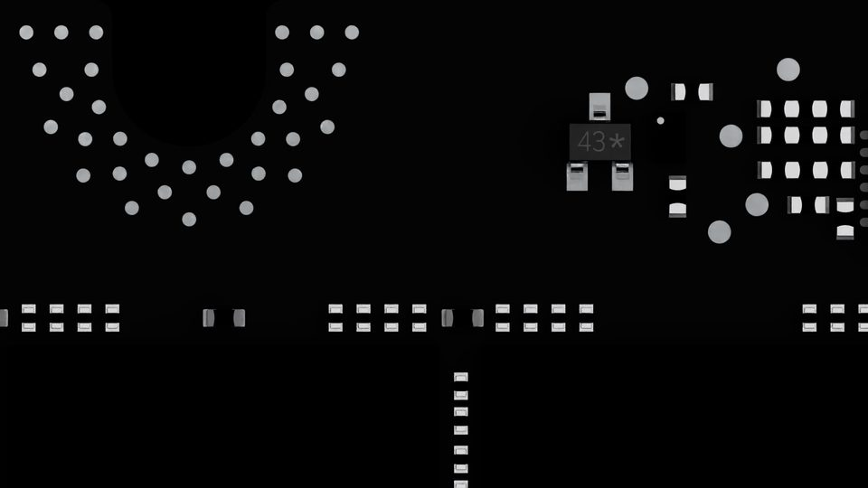
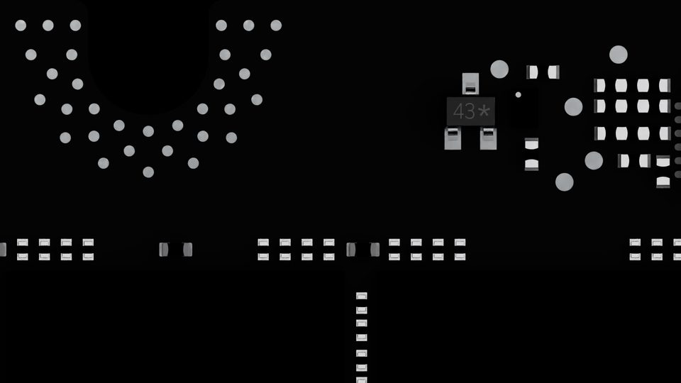
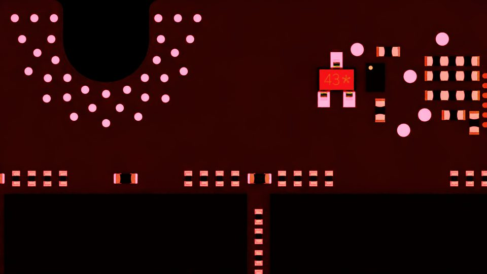
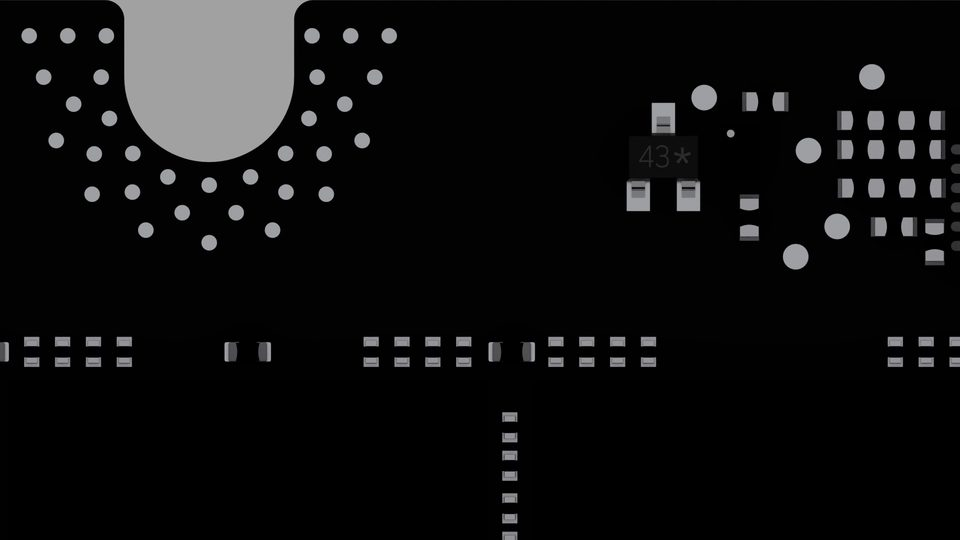

# Lighting Example

Four variants of the `good_image` pipeline differing **only** in lighting setup. The rest of the pipeline (`scan_grid: 10×10`, `pathtracing`, `writer`, `augmentation`, `camera_rotation`, `white_light` / `layers` blocks) is identical to `flow1_good_image/good_image.yaml`.

## Contents

- [Variants](#variants)
- [Side-by-side comparison](#side-by-side-comparison)
- [Flag glossary](#flag-glossary)
- [Running](#running)

## Variants

Each variant differs only in three top-level flags (any flag left unset falls back to its pipeline default — `false` for both `use_scene_lights` and `preserve_scene_light_color`):

| File | `use_scene_lights` | `preserve_scene_light_color` | `lighting.ring_light` | Visual effect |
|---|---|---|---|---|
| `good_image_scene_lights.yaml` | `true` | (unset) | `false` | Reuse lights authored in the scene USD; no rig built. Authored lights are whitened in place. |
| `good_image_preserve_color.yaml` | `true` | `true` | `false` | Same as above but keep the authored RGB layers (Inner_Red / Middle_Green / Outer_Blue) instead of whitening. |
| `good_image_ring_light.yaml` | (unset → `false`) | (unset) | `true` | Build a per-trigger RGB ring rig; intensity / cone / colour randomised per `lighting.layers`. |
| `good_image_dome_light.yaml` | (unset → `false`) | (unset) | `false` | Build the rig but drive every layer via `lighting.white_light` — a single white dome, no per-layer RGB. |

Outputs land in separate directories so the four can coexist:

- `${PAIDF_SIM_ROOT}/sdg_test_output/lighting_scene_lights/`
- `${PAIDF_SIM_ROOT}/sdg_test_output/lighting_preserve_color/`
- `${PAIDF_SIM_ROOT}/sdg_test_output/lighting_ring_light/`
- `${PAIDF_SIM_ROOT}/sdg_test_output/lighting_dome_light/`

## Side-by-side comparison

Same scan-grid cell (`rgb_0050.png`, board centre) from each of the four runs, thumbnailed to 960×540:

| `scene_lights` | `preserve_color` |
|---|---|
|  |  |
| **`ring_light`** | **`dome_light`** |
|  |  |

## Flag glossary

- **`use_scene_lights`** (top-level `bool`): skip the per-trigger rig builder (`disable_all_lights` + `build_ring_lights`) and use whatever lights the scene USD already authored. Pair with `lighting.ring_light: false` to avoid double-init.
- **`preserve_scene_light_color`** (top-level `bool`): only meaningful with `use_scene_lights: true`. Skip the "whiten everything" pass so authored RGB on scene lights survives.
- **`lighting.ring_light`** (under `lighting:`): if `true`, the pipeline builds a brand-new ring rig and stamps each `lighting.layers.<Name>` block per trigger. If `false`, the `lighting.white_light` block drives whatever light(s) the rig builder set up.

## Running

Same Docker invocation as the other examples — just swap the `--config` path to whichever variant you want:

```bash
export PCB_USD_PATH=/path/to/spark_lighting.usd
export PAIDF_SIM_ROOT=$(pwd)

VARIANT=good_image_ring_light.yaml    # or scene_lights / preserve_color / dome_light

docker run --gpus all --rm --network host \
  -e ACCEPT_EULA=Y -e PYTHONUNBUFFERED=1 \
  -e PCB_USD_PATH=$PCB_USD_PATH -e PAIDF_SIM_ROOT=$PAIDF_SIM_ROOT \
  -v /usr/share/nvidia/nvoptix.bin:/usr/share/nvidia/nvoptix.bin:ro \
  -v $(dirname $PCB_USD_PATH):$(dirname $PCB_USD_PATH):ro \
  -v $PAIDF_SIM_ROOT:/workspace/paidf-simulation \
  -v $PAIDF_SIM_ROOT/sdg_test_output:$PAIDF_SIM_ROOT/sdg_test_output \
  nvcr.io/nv-metropolis-dev/metropolis-sdg/paidf-simulation:<TAG> \
  "scripts/sdg/standalone/sdg_pipeline.py \
    --config /workspace/paidf-simulation/configs/lighting_example/$VARIANT \
    --pcba-config /workspace/paidf-simulation/configs/pcba_target.yaml"
```

Expected output structure is identical to [`../flow1_good_image/`](../flow1_good_image/README.md#expected-output) (100 RGB + 100 colorized seg + 100 raw seg label + bbox triples + metadata = 803 files per run).
