# Prompt Examples for Simulation Skills

Use natural language to drive the `simulation` skill in this repository. Each example lists the replication prompt (default container form), the derived config or routing decision, and the expected output layout.

## Definitions

- **Natural Prompt (user input)**: Free-form English. The skill may interpret it ambiguously.
- **Normalized Intent (agent-parsed)**: internal structured interpretation. Not user-facing.
- **Execution Expectations (validation contract)**: what the agent MUST enforce. Correct flow, component mapping, defect behavior, Day-0 vs Day-1 routing.

ROI is **not** a user-facing capability. It is an internal pipeline step. Day-1 workflows invoke ROI automatically.

## Defaults

- **Default PCB asset:** set `PCB_USD_PATH` to your `spark_lighting.usd` (Spark board). You can override by naming a `.usd` in your prompt.
- **Default execution:** Docker (`paidf-simulation:sqa` or `:local-sqa-test` fallback). To run on the host instead of Docker, add `, local` to the prompt.
- **Default lighting:** scene-authored (`use_scene_lights: true` + `preserve_scene_light_color: true`). To override scene lighting, include `ring light` or `dome light` in the prompt.
- **Default output dir:** `${PAIDF_SIM_ROOT}/sdg_test_output/<auto-slug>/`. You can name a path with `to <PATH>`.

## The skill

- **`/simulation`**: PAIDF Simulation. One skill with two internal tracks. A Stage-0 router selects the track:
  - **single-flow track**: good / good_fixed / defect / missing / lighting renders + paired golden/defect for ChangeNet.
  - **ROI track**: per-ROI crops from CAD USDs. **Day-0:** synthetic `scan_grid` plus per-component crops. **Day-1:** real photo, MI registration, and ROI triples.

The merged router preserves this discipline: a photo path or component name alone does not select the ROI track. You must explicitly request a crop, registration, or alignment.

## Status legend

- ✓ **verified**: Ran end-to-end on Spark USD; output validated.
- ⚠ **partial**: flow and base config correct, but a sub-knob (per-defect component filter, camera positioning, multi-component expansion) is not wired yet. Output is plausible but may not match your stated intent.
- 🚫 **gap**: current skill does not implement; tracked in [Skill Gaps and Follow-Ups](#skill-gaps-and-follow-ups).
- ⏭ **ROI track**: handled by the ROI track of `/simulation`.
- ✗ **reject**: failure case; skill MUST refuse or clarify.

---

# Section 1. Good Image Generation, Board-Level (Flow 1, Day-0)

### 01. Generate 20 Good PCB Images   ✓

**Prompt** (container default):
```
/simulation Generate 20 good PCB images, to OUTPUT_PATH
```

**Derived config:** `configs/runs/pm2_01_board_good_count20.yaml`
**Overrides:**
- `max_image_count: 20`
- `scan_grid: {x_num: 4, y_num: 5}` ← balanced grid (20 = 4×5)
- `num_triggers: 1`

**Expected output:** `OUTPUT_PATH/trigger_0000/`
- 20 × `rgb_0000.png` … `rgb_0019.png` (1920×1080, scene-lit)
- 20 × `semantic_segmentation_NNNN.png` + `_labels_NNNN.json`
- 20 × `bounding_box_2d_tight_NNNN.npy` + `_labels_NNNN.json` + `_prim_paths_NNNN.json`
- `metadata.json` + `metadata.txt`

**Sample:** 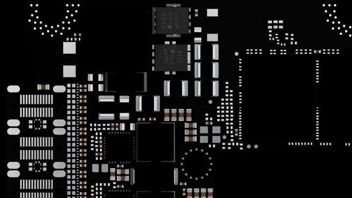

### 02. Create a Dataset of Normal Board Images   ✓

**Prompt:**
```
/simulation Create a dataset of normal board images, to OUTPUT_PATH
```

**Derived config:** Same base as 01 + skill's default count policy.
**Overrides:** `max_image_count: 20`, `scan_grid: {4, 5}`, `num_triggers: 1`. The skill selects the default count (20), informs you, and offers to increase it.

**Expected output:** Same as 01.

**Sample:** 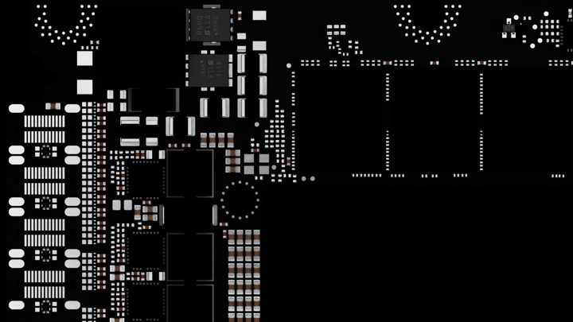

### 03. Generate PCB Images With Dome Lighting   ✓

**Prompt:**
```
/simulation Generate PCB images with dome lighting, to OUTPUT_PATH
```

**Derived config:** `configs/runs/pm_03_board_good_dome_lighting.yaml`
**Overrides:**
- `max_image_count: 5`
- `use_scene_lights: false`
- `lighting.ring_light: false` ← single white dome using `lighting.white_light`

**Expected output:** `OUTPUT_PATH/trigger_0000/`
- 5 × rgb / seg / bbox triples
- noticeably brighter and higher-contrast than scene-lit baseline (the dome at 80–220 intensity drives everything)

**Sample:** 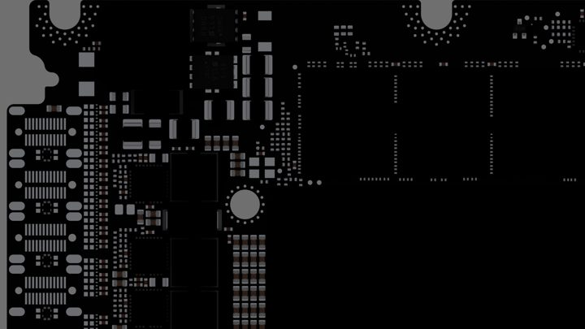

### 04. Generate Images of Boards With Passive Components   ⚠

**Prompt:**
```
/simulation Generate images of boards with passive components, to OUTPUT_PATH
```

**Status:** The `chip_passive` subset exists in `configs/components.yaml`, but the natural-language parser does not yet map "passive" to `chip_passive` (skill gap #1). The run currently sets `component_types: ALL`. Output resembles example 02; semantic labels include inductors.

**Sample:** 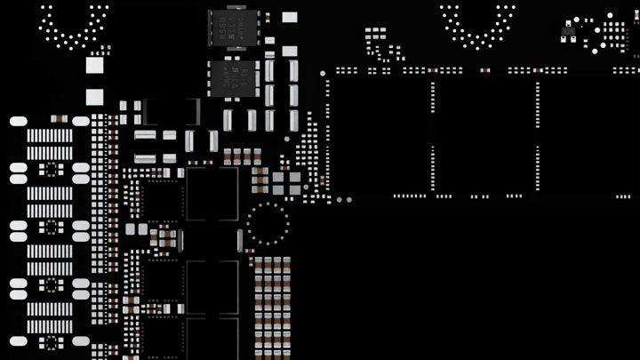

---

# Section 2. Good Image Generation, Component-Level (Flow 1B, Day-0)

### 05. Generate Images of Component _0402_H060   ⚠

**Prompt:**
```
/simulation Generate images of component _0402_H060, to OUTPUT_PATH
```

**Derived config:** `configs/flow1b_good_fixed/good_fixed.yaml`
**Overrides:** `max_image_count: 5`, `samples_per_position: 5`

**Status:** Routes to `good_fixed` (correct flow), but the camera remains at the canonical capacitor position. Component-name-to-camera lookup is skill gap #6.

**Expected output:** 5 × fixed-camera close-ups with solder fillet + tin perlin normals + per-sample material randomization. (Note: known semantic_segmentation segfault under `samples_per_position > 0`; seg PNGs may be missing or truncated.)

**Sample:** 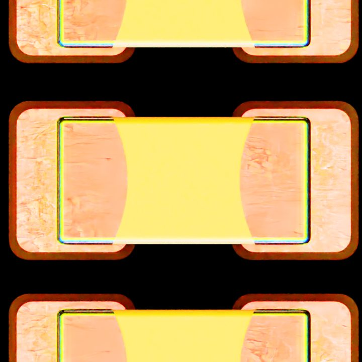

### 06. Generate 5 Images Each for _0402_H060 and _0603_H070   🚫

**Prompt:**
```
/simulation Generate 5 images each for _0402_H060 and _0603_H070, to OUTPUT_PATH
```

**Status:** The skill currently runs a single canonical pass (5 frames, one camera). Multi-component expansion (two sequential runs at different camera positions) is skill gap #4. Output resembles example 05.

**Sample:** 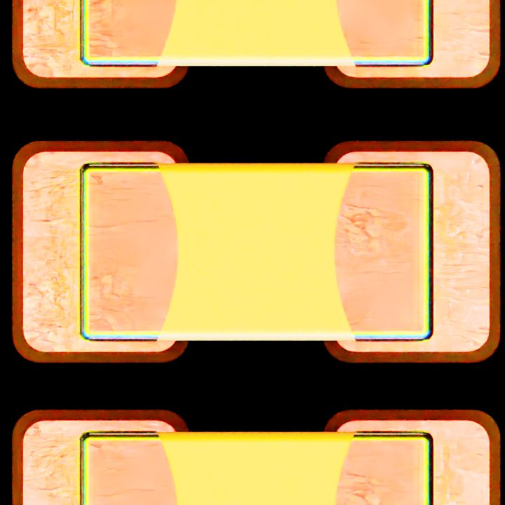

### 07. Generate Images of SOT-5 IC _115-0138-000   🚫

**Prompt:**
```
/simulation Generate images of SOT-5 IC _115-0138-000, to OUTPUT_PATH
```

**Status:** An IC-board `good_fixed` config does not exist yet (gap #3). The skill falls back to the Spark canonical capacitor. To support this prompt, add `configs/flow1b_good_fixed_IC/` and tune the camera.

**Sample:** 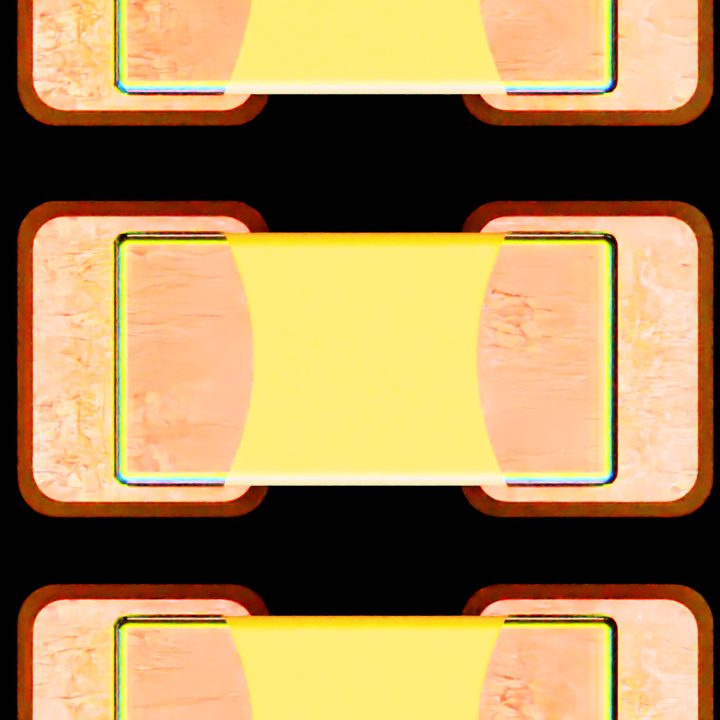

### 08. Generate Images of _315-1041-000 With Ring Light   ⚠

**Prompt:**
```
/simulation Generate images of _315-1041-000 with ring light, to OUTPUT_PATH
```

**Derived config:** `configs/runs/pm_08_component_good_315_1041_ring_light.yaml`
**Overrides:** `max_image_count: 5`, `samples_per_position: 5`, `use_scene_lights: false`, `lighting.ring_light: true`

**Status:** ring rig override applies correctly. Camera at canonical position (same lookup gap as 05).

**Expected output:** 5 × close-ups with per-trigger RGB ring stamping (Inner_Red / Middle_Green / Outer_Blue layers visible on solder).

**Sample:** 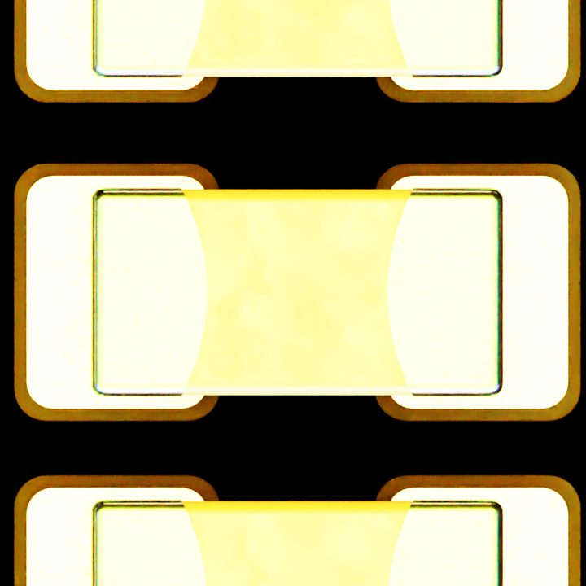

---

# Section 3. Defect Generation, Synthetic (Flow 2, Day-0, Structural)

**Structural defects** include pose defects (shift, tombstone, sideflip, reverse_polarity) and missing components. **Surface defects** (scratches, residue) belong to Day-1.

### 09. Generate 5 Missing Defects for _0402_H060   ⚠

**Prompt:**
```
/simulation Generate 5 missing defects for _0402_H060, to OUTPUT_PATH
```

**Derived config:** `configs/runs/pm_09_defect_missing_0402_H060.yaml`
**Overrides:** `max_image_count: 10` (2 × N to account for ref + defective passes per cell)

**Status:** `missing.component_types` filter does not restrict to a single substring currently (gap #2); runs across all 23 components.

**Expected output:** `OUTPUT_PATH/trigger_0000/`
- `defective/rgb_0000.png` … `_0004.png` (5 defective-pass renders, each with a random subset of components hidden)
- `reference/rgb_0000.png` … (5 clean reference renders, paired with defective)
- semantic_segmentation + bbox JSONs per pass

**Sample:** 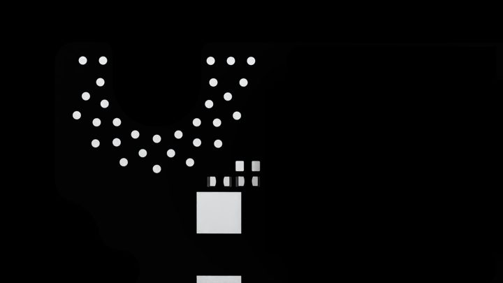

### 10. Generate Tombstone Defects for _0603_H070   ⚠

**Prompt:**
```
/simulation Generate tombstone defects for _0603_H070, to OUTPUT_PATH
```

**Derived config:** `configs/runs/pm_10_defect_tombstone_0603_H070.yaml`
**Overrides:**
- `max_image_count: 5`
- `defects.{shift,sideflip,reverse_polarity}.enabled: false`
- `defects.tombstone.enabled: true`

**Status:** tombstone-only is enforced. Per-defect `component_types` filter not supported on tombstone currently; only `reverse_polarity` has it (gap #2). Tombstoning may therefore affect other components, not strictly _0603_H070.

**Expected output:** 5 rgb + 5 seg (each ~110 KB) showing components tilted on Y axis.

**Sample:** 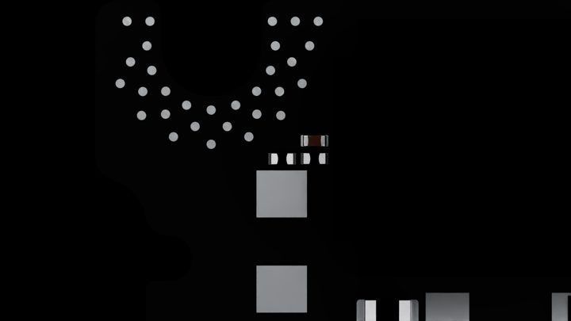

### 11. Generate Shift Defects for _130-1054-000   ⚠

**Prompt:**
```
/simulation Generate shift defects for _130-1054-000, to OUTPUT_PATH
```

**Overrides:** same pattern as 10, only `defects.shift.enabled: true`.

**Status:** shift-only enforced. Component filter gap same as 10.

**Expected output:** 5 rgb + 5 seg with XY-translated + Z-rotated components.

**Sample:** 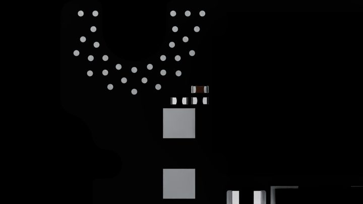

### 12. Generate Polarity Defects for _032_0667   ✓

**Prompt:**
```
/simulation Generate polarity defects for _032_0667, to OUTPUT_PATH
```

**Derived config:** `configs/runs/pm_12_defect_polarity_032_0667.yaml`
**Overrides:**
- `max_image_count: 5`
- `defects.{shift,tombstone,sideflip}.enabled: false`
- `defects.reverse_polarity.enabled: true`
- `defects.reverse_polarity.component_types: [_032_0667]` ← per-defect filter works for polarity

**Status:** Verified. `reverse_polarity` is the one defect type with a substring filter currently.

**Expected output:** 5 rgb + 5 seg showing _032_0667 component instances flipped 180° around Z.

**Sample:** 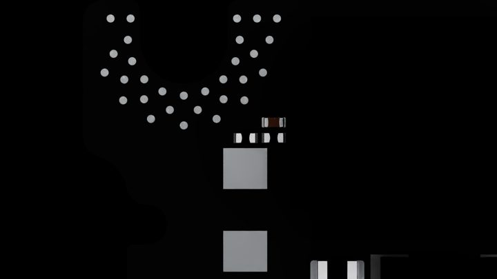

### 13. Generate Missing Defects for Two Components   ⚠

**Prompt:**
```
/simulation Generate missing defects for two components, to OUTPUT_PATH
```

**Status:** runs at default (no filter, all 23 component types eligible). Multi-component-pair expansion is a follow-up.

**Expected output:** ref + defective triples in subdirs, ~4 rgb (cap=8 → 4 cells).

**Sample:** 

### 14. Generate Random Defects Across the Board   ✓

**Prompt:**
```
/simulation Generate random defects across the board, to OUTPUT_PATH
```

**Derived config:** `configs/runs/pm_14_defect_random.yaml`
**Overrides:** `max_image_count: 5`. Enables all four defect modes at default ratios.

**Expected output:** 5 rgb + 5 seg, each frame potentially showing a mix of defect modes on different components.

**Sample:** 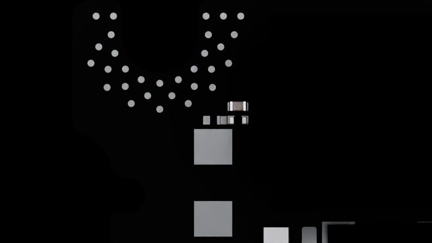

---

# Section 4. Real Image and Day-1 (ROI Track)

For Day-1, you supply a real PCB photo. The router assigns the ROI track (Day-1 variant), then runs cad2roi, MI alignment, and per-component crops. Only **surface defects** are valid (scratch, residue, discoloration). Structural defects (missing, pose) are rejected.

Bundled reference photos: `assets_final/assets/input_real_image/{0402_H060, 0603_H100, 115_2819_000}.jpg`.

### 15. Generate Defects on My PCB Images   🚫

**Prompt:**
```
/simulation Generate defects on my PCB images, to OUTPUT_PATH
```

**Routing:** ROI track, Day-1 variant.

**Expected output (when fully implemented, gap #7):**
- `OUTPUT_PATH/roi/synth/<component>_<idx>.png`: synthetic ROI crop
- `OUTPUT_PATH/roi/real/<component>_<idx>.png`: registered real-photo crop
- `OUTPUT_PATH/roi/mask/<component>_<idx>.png`: pixel mask
- `OUTPUT_PATH/roi_defective/<component>_<idx>.png`: same crops with surface defects injected (scratch / residue overlays)
- _(Optional, future)_ `OUTPUT_PATH/before_after.gif`: side-by-side animation per ROI

**Current behavior:** cad2roi emits only the first three items (ROI triples). Surface-defect injection is not implemented yet.

### 16. Generate 5 Defects per Image   🚫

**Prompt:**
```
/simulation Generate 5 defects per image, to OUTPUT_PATH
```

**Status:** Per-image count semantics and surface-defect injection are pending. The router assigns the ROI track.

### 17. Generate Defects for My Capacitor Images   🚫

**Prompt:**
```
/simulation Generate defects for my capacitor images, to OUTPUT_PATH
```

**Status:** Component-class filter on the ROI emission step is a follow-up. The router assigns the ROI track.

### 18. Apply Defect Variations to My IC Images   🚫

**Prompt:**
```
/simulation Apply defect variations to my IC images, to OUTPUT_PATH
```

**Status:** Same gaps as 17 and IC-component substring mapping.

---

# Section 5. Failure / Negative Cases

For these prompts, the skill must not silently route or succeed. It must reject the request or ask for clarification.

### 19. Generate Missing Component Defects on My Images   ✗

**Prompt:**
```
/simulation Generate missing component defects on my images, to OUTPUT_PATH
```

**Expected response:** *"Missing components is a structural defect (Day-0 only). To do this from a real photo, render synth via Day-0 first, then composite. Want me to switch to a Day-0 missing-defect run instead?"*

### 20. Generate Defects for Component ABC123   ✗

**Prompt:**
```
/simulation Generate defects for component ABC123, to OUTPUT_PATH
```

**Expected response:** *"`ABC123` does not match any component in `configs/components.yaml` or in the Spark USD. Available: `_0805U_H150`, `_0402_H060`, …, or the keywords `ALL` / `0`. Which did you mean?"*

### 21. Generate Defects   ✗

**Prompt:**
```
/simulation Generate defects, to OUTPUT_PATH
```

**Expected response:** *"Which defect mode? `shift` / `tombstone` / `sideflip` / `reverse_polarity` / `missing` / random? Also: how many frames?"*

### 22. Generate Defects and Extract Components   ✗

**Prompt:**
```
/simulation Generate defects and extract components, to OUTPUT_PATH
```

**Expected response:** *"Two tracks in one ask: defect generation (single-flow track) and ROI extraction (roi track). Run them in order, or specify one?"*

### 23. Generate Images Without Specifying Component or Type   ✗

**Prompt:**
```
/simulation Generate images, to OUTPUT_PATH
```

**Expected response:** *"Defaulting to Flow 1 (board-level good, scene lights, all 23 component labels). How many frames? Override anything?"*

---

# Skill Gaps and Follow-Ups

| # | Gap | Affected sections | Status | Effort |
|---|---|---|---|---|
| 1 | Subset-keyword auto-detection ("passive components" → `chip_passive`) | Section 1.4 | open (data ready in `configs/components.yaml`; parser hook missing) | About 30 minutes |
| 2 | Per-defect `component_types` filter on `shift` / `tombstone` / `sideflip` / `missing` | Section 3.1, 3.2, 3.3, 3.5 | open | About 1 hour |
| 3 | IC-board good_fixed config (camera + pcba_target for `115_2819_000`) | Section 2.3 | open | About 1 hour |
| 4 | Multi-component expansion (two sequential runs at different camera positions) | Section 2.2 | open | About 2 hours |
| 5 | Structured "Normalized Intent" JSON emission in Stage 1 | all rows | open | About 2 hours |
| 6 | Component-name → camera-position lookup for good_fixed | Section 2 all rows | open | About 3 hours |
| 7 | Day-1 surface-defect injection on ROI triples | Section 4 all rows | open | About 1 week |

**This branch closes the following:**
- Named subsets in `configs/components.yaml` (`cap_small`, `cap_large`, `chip_passive`, `inductor`)
- Default count policy (good=20×3-cell balanced grid, defect/missing=100×10×10, good_fixed=100 samples)
- Balanced-grid factorization for `count: N` (prefers single trigger; primes ask user)
- `prompt_metadata.json` sidecar (v0.2.1) with replication_prompt, replication_note

---

# Decision tree

All flows start with `/simulation`. The Stage-0 router classifies the track as follows:

```
Everything is /simulation. The Stage-0 router classifies the track:

User EXPLICITLY mentions cad2roi / usd2roi / ROI / MI alignment / crop / bridge?
├── YES → track = roi  (Day-0 if no photo, Day-1 if photo)
└── NO  → track = single-flow  (good / good_fixed / defect / missing / lighting / paired)

(A real PCB photo path alone does NOT route to the roi track. The user must say
 what they want -- 'register', 'align', 'crop ROIs' -- otherwise default to single-flow.)
```

---

# Tips for writing prompts

1. **Start with an action verb and a frame count** (for example, "Generate 5").
2. **Defect mode** preferences: "only tombstone", "shift and polarity only", "no sideflip".
3. Add `local`, `fast`, or `host run` to execute on the host instead of Docker.
4. **`seed N`** for reproducibility.
5. **Board** when not Spark: "for the IC board", "for 0603 H100".
6. **Lighting** mode (default = scene; alternatives = `ring light` / `dome light`).
7. **USD path** override: `use /path/to/x.usd` or `with the USD at X`.
8. **Output path** override: Use `to /path/to/out`. For Docker runs, the skill bind-mounts the parent directory.
9. **Resolution**: `1024`, `2048`, `1920x1080` all parse.
10. **The approval gate prevents mistakes.** Review the YAML diff and command before you approve the run.

---

# References

- `configs/README.md`: feature table of every config under `configs/`. (Currently empty by design; populate when stable.)
- `configs/lighting_example/README.md`: per-lighting-flag explanation
- `configs/components.yaml`: master list and named subsets
- `skills/<skill>/references/`: per-skill reference material
- `skills/simulation/evals/evals.json`: flat nvcarps schema (15 cases — `[{id, question, expected_skill, ground_truth, expected_behavior[]}]`) consumed by nvcarps Tier 3 live agent evaluation
- `sdg_test_output/<run_name>/prompt_metadata.json`: per-run sidecar (prompt, intent, configs, overrides, frame counts)
